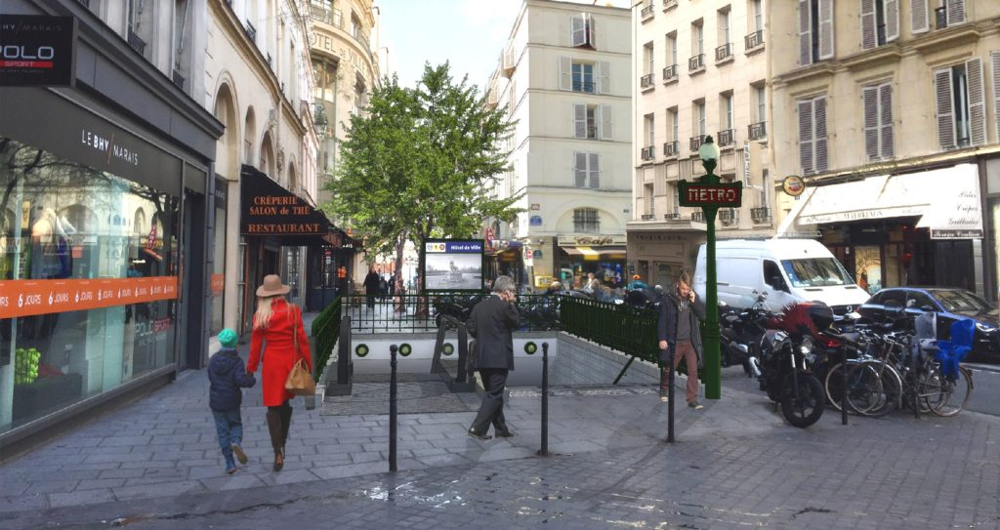

.. _IAAS:
************************
Module IAAS
************************

.. _IAASINTRO:
Introduction
=============

Présentation générale
~~~~~~~~~~~~~~~~~~~~~~

Fonctions développées
~~~~~~~~~~~~~~~~~~~~~~

.. topic:: AWS / IAAS :

	- Serverless, oui

	- Gestion des métadonnées, oui

	- Utilisation d'un bucket S3, oui

	- Fichier test et commande de requête, oui

	- Utilisation AWS Rekognition, oui

Mise en oeuvre
~~~~~~~~~~~~~~~

.. _IAASSLS:
Serveless
==========

.. _IAASTST:
Fichier de test
================

.. code-block:: bash

	curl -X POST "http://@IPv4:8000/rekognition" -F "data_file=@~FilRouge/Testeurs/Ville.jpg" > Ville_from_JPEG_to_JSON.json

Afin de tester le serverless, je vous propose de tester cette commande vous permettant d'obtenir l'ensemble des informations que peut traiter le programme. (mise à jour de l'adresse IP avant exécution)
Il sera peut-être nécessaire de corriger à la marge le chemin d'accès au fichier de test.

.. _IAASMETA:
Métadonnées
============

Les métadonnées récoltées sont de deux origines :

* métadonnées générales : nom du fichier, MIMEType du fichier et taille du fichier

* métadonnées particulières : objets détectés par l'API rekognition :ref:`IAASREKO`

.. _IAASS3:
AWS Bucket S3
==============

Un bucket S3 a été déployé manuellement via le navigateur Web pour le stockage des fichiers d'origine et les fichiers JSONifiés. La gestion des suppressions périodiques a été effectuée de manière manuelle via le navigateur Web et sur le programme de création du ServerLess.

Un point d'amélioration serait l'automatisation de la création et de la gestion du bucket à partir d'un programme/script.

.. _IAASREKO:
AWS Rekognition
================

Dans le cadre du développement initial de l'API sur une instance EC2, un appel de l'API Rekognition d'Amazon a été mis en place. Cette application permet d'enrichir les métadonnées de l'image considérée. Vous trouverez son implémentation dans le code source de l'API.

Elle permet de renvoyer les objets détectés sur l'image considérée.

Exemple :

**Photo traitée :**

**Métadonnées :**

.. code-block:: YAML

    {"META": {
        "nom_fichier": "Ville.jpg",
        "type_fichier": "image/jpeg",
        "taille_fichier": 135784,
        "labels_rekognition": [
            "Pedestrian",
            "Person",
            "Human",
            "Path",
            "Urban",
            "Town",
            "Street",
            "Building",
            "City",
            "Road",
            "Machine",
            "Wheel",
            "Motorcycle",
            "Transportation",
            "Vehicle",
            "Downtown",
            "Sidewalk",
            "Pavement",
            "Bike",
            "Bicycle",
            "Automobile",
            "Car",
            "Walkway",
            "Apparel",
            "Shoe",
            "Clothing",
            "Footwear",
            "Asphalt",
            "Tarmac",
            "People",
            "Architecture",
            "Bus Stop",
            "Shelter",
            "Rural",
            "Nature",
            "Countryside",
            "Outdoors",
            "Walking",
            "Intersection",
            "Neighborhood",
            "Zebra Crossing"}
    }

:ref: `_PythonAWS`
:ref: `_PythonCODE`