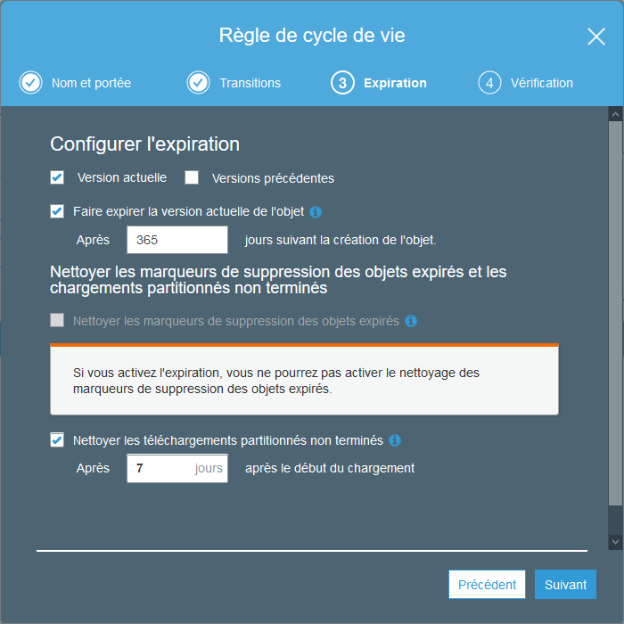

************************
Module IAAS
************************

Introduction
=============

Présentation générale
~~~~~~~~~~~~~~~~~~~~~~

Fonctions développées
~~~~~~~~~~~~~~~~~~~~~~

.. topic:: AWS / IAAS :

	- Serverless, en partie

	- Gestion des métadonnées, oui

	- Utilisation d'un bucket S3, oui

	- Fichier test et commande de requête, oui

	- Utilisation AWS Rekognition, oui

Mise en oeuvre
~~~~~~~~~~~~~~~

Serveless
==========

La mise en place de ServerLess s'effectue via un environnement virtuel décrit dans la partie Serverless du Git.
'https://github.com/AlanJBX/FilRouge/tree/master/Serverless'

La partie implémentation du server et la partie code de l'application se trouvent à la fin de ce chapitre_.

.. _chapitre : https://pfralanjbx.readthedocs.io/fr/latest/IAAS.html#code-serverless

Si les deux parties fonctionnent indépendamment, un problème n'a pu être entièrement résolu. En effet, lors du traitement du fichier envoyé lors de la requête *CURL*, ce dernier n'est pas pris en compte par l'application directement. Il est nécessaire de sauvegarder localement le fichier avant de pouvoir le traiter correctement. Cependant, le serverless n'accepte pas cette sauvegarde locale.

J'ai donc implémenté le code différemment de l'application Flask pur afin de travailler avec un objet stocké puis récupéré sur le bucket S3. Si ce code fonctionne indépendamment, je n'ai pas pu le tester via la version Serverless.

Fichier de test
================

.. code-block:: bash

	curl -X POST "http://54.246.242.159:8000/rekognition" -F "data_file=@~/FilRouge/Testeurs/Ville.jpg" > Ville_from_JPEG_to_JSON.json

Afin de tester le serverless, je vous propose de tester cette commande vous permettant d'obtenir l'ensemble des informations que peut traiter le programme. (mise à jour de l'adresse IP avant exécution)
Il sera nécessaire de corriger l'adresse IP et peut-être nécessaire de corriger à la marge le chemin d'accès au fichier de test.

Métadonnées
============

Les métadonnées récoltées sont de deux origines :

* métadonnées générales : nom du fichier, MIMEType du fichier et taille du fichier

* métadonnées particulières : objets détectés par l'API rekognition, voir la partie AWS Rekognition

AWS Bucket S3
==============

Un bucket S3 a été déployé manuellement via le navigateur Web pour le stockage des fichiers d'origine et les fichiers JSONifiés. La gestion des suppressions périodiques a été effectuée de manière manuelle via le navigateur Web et sur le programme de création du ServerLess.

Un point d'amélioration serait l'automatisation de la création et de la gestion du bucket à partir d'un programme/script.

En théorie, la suppression des données est fixée à 365 jours.

.. code-block:: YAML

    Resources:
      TestBucket:
      Type: AWS::S3::Bucket
      Properties:
        BucketName: stockagefbsdpfilrougealan
        AccessControl: Private
        LifecycleConfiguration:
          Rules:
          - Id: DeleteContentAfter365Days
            Prefix: ''
            Status: 'Enabled'
            ExpirationInDays: 365

De manière pratique, une suppression des données a été fixée à 365 jours via le navigateur.

AWS Rekognition
================

Dans le cadre du développement initial de l'API sur une instance EC2, un appel de l'API Rekognition d'Amazon a été mis en place. Cette application permet d'enrichir les métadonnées de l'image considérée. Vous trouverez son implémentation dans le code source de l'API.

Elle permet de renvoyer les objets détectés sur l'image considérée.

Exemple :

**Photo traitée :**

.. image:: IMG/Ville.jpg
   :align: center

**Métadonnées :**

.. code-block:: YAML

    {"META": {
        "nom_fichier": "Ville.jpg",
        "type_fichier": "image/jpeg",
        "taille_fichier": 135784,
        "labels_rekognition": [
            "Pedestrian",
            "Person",
            "Human",
            "Path",
            "Urban",
            "Town",
            "Street",
            "Building",
            "City",
            "Road",
            "Machine",
            "Wheel",
            "Motorcycle",
            "Transportation",
            "Vehicle",
            "Downtown",
            "Sidewalk",
            "Pavement",
            "Bike",
            "Bicycle",
            "Automobile",
            "Car",
            "Walkway",
            "Apparel",
            "Shoe",
            "Clothing",
            "Footwear",
            "Asphalt",
            "Tarmac",
            "People",
            "Architecture",
            "Bus Stop",
            "Shelter",
            "Rural",
            "Nature",
            "Countryside",
            "Outdoors",
            "Walking",
            "Intersection",
            "Neighborhood",
            "Zebra Crossing"}
    }

L'autorisation de connexion s'effectuer en deux temps :
* Vérification des AWS Credentials Keys
* Vérification de l'autorisation temporaire délivrée par Rosetta

Code Serverless
================

.. literalinclude:: ../Serverless/serverless.yml

.. literalinclude:: ../Serverless/app.py

.. literalinclude:: ../Serverless/aws.py