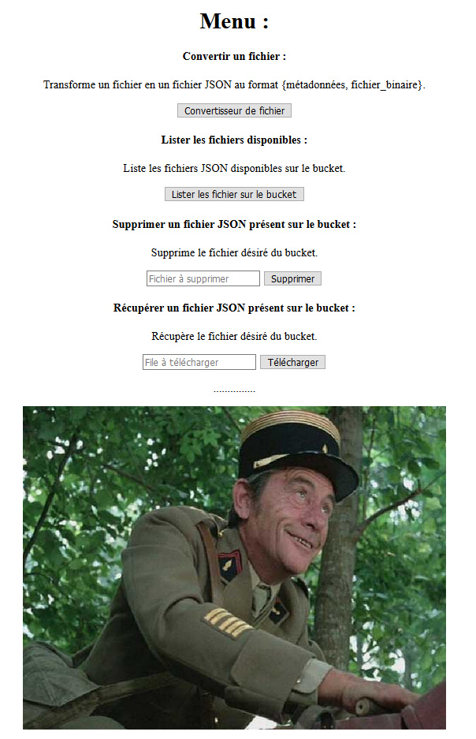
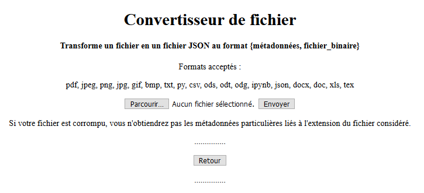
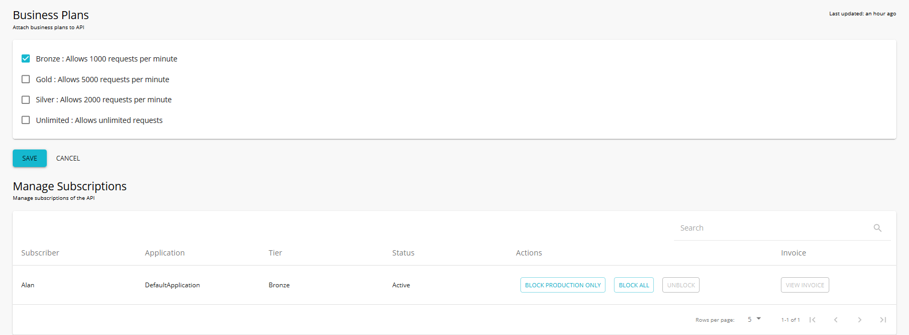

************************
Module SOA
************************

Introduction
=============

Présentation générale
~~~~~~~~~~~~~~~~~~~~~~

La gestion de l'API se fait de trois manières différentes :
* une documentation open-source de l'application : permettant à chaque de se l'approprier et de l'améliorer.
* une gestion API : via un API manager pour accéder à l'application
* une document swagger : permettant de rapidement obtenir les requêtes nécessaires à l'utilisation de l'API.

Fonctions développées
~~~~~~~~~~~~~~~~~~~~~~

* Interface graphique, oui
* Commandes CURL, oui
* API Manager, oui
* API Limitation requête, oui
* API Sécurisation, oui
* API Interconnectée, oui
* API Documentation, oui

Interface graphique
====================

Avant la mise en place des requêtes via CURL, il m'a semblé plus facile d'utiliser une interface graphique qui me permettrait d'accéder rapidement aux fichiers que je souhaitais tester dans le cadre de la JSONification. J'ai, par conséquent développé, une première interface graphique permettant le chargement du fichier à convertir. Par la suite et afin d'améliorer l'expérience utilisateur, j'ai mis en place les différentes pages disponibles.
Vous trouverez ci-dessous les interfaces relatives au choix de la fonction désirée ainsi que la page du convertisseur.

*(les pages sont susceptibles d'avoir évoluées à la marge depuis la rédaction de ce document)*

Commandes CURL
===============

L'ensemble des commandes CURL disponibles pour l'application sont disponibles à l'adresse suivante : 'http://54.246.242.159:8000/swagger/'

La génération des commandes CURL en HTTPS ne se sont pas montrées concluantes et je n'ai pas eu le temps de débugger le programme. Il semblerait que cela soit lié aux cookies qu'utilise l'application dans la gestion de l'authentification de l'utilisateur et des LOGs (la gestion de l'HTTPS se fait facilement avec CURL avec le rajout de l'option *-k* à la ligne de commande)

.. literalinclude:: ../Flask/static/swagger.yml

API Manager
============

L'API Manager suivant a été mis en place pour regrouper nos APIs et les gérer : 'https://52.51.220.151:9443/devportal/apis'

L'API relative à l'application developpée ici est : 'https://52.51.220.151:9443/devportal/apis/e28ff3c8-9755-4d38-ab6e-8c3117bf18b8/overview'

Attention néanmoins à la partie de test du CURL, en effet, l'adresse fournie pour le site ne correspond pas à l'adresse IP du serveur.

API Limitation requête
=======================

A l'aide de l'API Manager, une limitation à 1000 requêtes par minute est choisie.

API Sécurisation
==================

A l'aide de l'API Manager et d'un compte WSO2, il est possible d'accéder à l'API via un Token préalablement demandé.

API interconnectée
===================

L'application développée est connectée au Bucket S3 d'Amazon et appelle l'API Rekognition AWS. Plus d'informations : Rekognition_.

.. _Rekognition : https://pfralanjbx.readthedocs.io/IAAS.html#aws-rekognition

Une tentative de connection à une autre API de conversion de fichier en JSON a été également implémenté. Plus d'informations : Python_.

.. _Python : https://pfralanjbx.readthedocs.io/Python.html#appel-vers-une-autre-api

Documentation
==============

La documentation de l'application est constituée du présent document (principalement la partie Python_ ) ainsi que la page swagger de l'application 'http://54.246.242.159:8000/swagger/'

.. _Python : https://pfralanjbx.readthedocs.io/Python.html