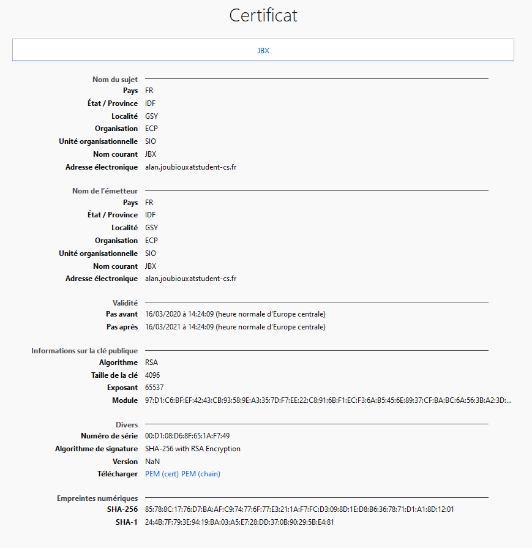
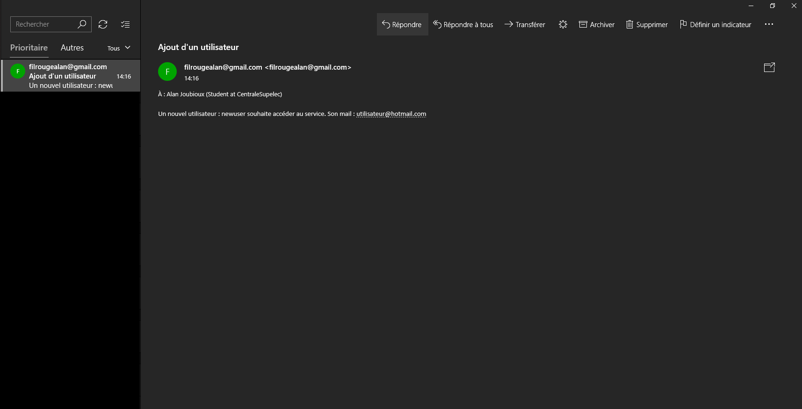

************************
`Module SSI`_
************************

Introduction
=============

Deux modules ont été partiellement ou complètement implémentés :

* Module HTTPS : un certificat temporaire a été mis en place pour une connexion certifiée

* Modulen authentification : mise en place d'un traitement des utilisateurs avec connexion par mot de passe à l'application

Fonctions développées
~~~~~~~~~~~~~~~~~~~~~~

.. topic:: SSI :

	- Connexion SSH via clé et id/mdp, oui

	- Protocole HTTPS, oui

	- Connexion avec id/mdp à l'application, oui

	- Gestion d'un nouvel utilisateur, oui

HTTPS
======

Dans un premier temps, il a été essayé d'obtenir un certificat à l'aide de *Letsencrypt*, cependant, le nom de domaine du serveur, lié à AWS a été refusé.

Dans un second temps, l'outils *openssl* a permit rapidement de fabriquer un certificat temporaire permettant alors le déploiement du serveur en version HTTPS.
Vous trouverez ci-dessous le certificait utilisé :

Authentification
=================

Dans le cadre de l'identification/authentification permettant un accès à l'application, plusieurs briques ont été développées :

* Gestion admin : l'application catégorise l'utilisateur en admin ou utilisateur *lambda*. L'admin a les droits (décidés arbitrairement) de récupérer des fichiers JSONifiés et/ou de les supprimer. Les droits sont testés en permanence lors de l'utilisation de l'application.

* Gestion des mots de passe : la présence en clair des mots de passe est réduite au minimum. Ainsi le mot de passe n'est utilisé en clair par l'application uniquement lors du test permettant de déterminer si il est ou non valide pour un nouvel utilisateur. Sinon, uniquement le hash du mot de passe est utilisé. Même l'admin n'a pas accès au mot de passe en clair.

* Gestion des nouveaux utilisateurs : il est possible de rentrer un nouvel utilisateur à condition que ces identifiant, mot de passe et adresse mail soient conformes. Un mail est alors envoyé à l'administrateur.

Il aurait été envisageable de proposer un générateur de mot de passe aléatoire que l'utilisateur aurait reçu par mail une fois son inscription terminée.